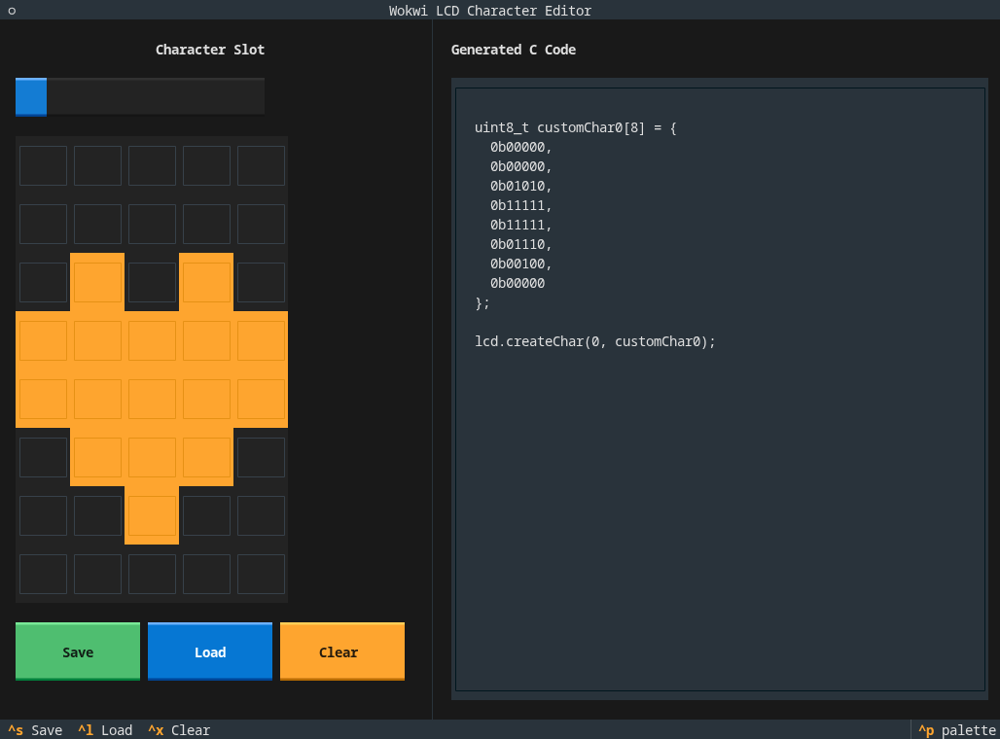

# Wokwi LCD Character Editor

A simple editor for creating custom LCD characters for Wokwi simulations.



## Usage

1. Clone the repo:
```bash
git clone https://github.com/jokelbaf/wokwi-lcd-char-editor
```
2. Install deps:
```bash
uv sync
```
3. Run:
```bash
uv run main.py
```

## License

The project is licensed under the MIT license. See [LICENSE](LICENSE) for details.
